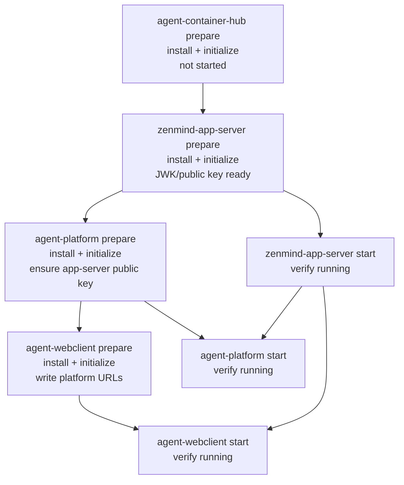

# Bootstrap Startup Order

本文描述桌面端首次 bootstrap 时内置核心服务的准备和启动顺序。

目标是保留初始化依赖的确定性，同时缩短后续服务启动等待时间。

## 服务范围

首次 bootstrap 涉及 4 个内置核心服务：

- `agent-container-hub`
- `zenmind-app-server`
- `agent-platform`
- `agent-webclient`

其中 `agent-container-hub` 是 install-only startup service：首次启动时只准备，不作为强启动依赖。

## 阶段拆分

bootstrap 分为两个大阶段：

1. Prepare 阶段
2. Start 阶段

Prepare 阶段仍然串行执行，用来保证配置、密钥和端口等前置依赖按顺序生成。

Start 阶段采用保守并行：

1. 先启动并验证 `zenmind-app-server` 进入 running。
2. `zenmind-app-server` running 后，再并行启动 `agent-platform` 和 `agent-webclient`。
3. 如果 `zenmind-app-server` 未 running，则不启动后续依赖服务。

## DAG



## 顺序说明

Prepare 顺序：

```text
agent-container-hub
-> zenmind-app-server
-> agent-platform
-> agent-webclient
```

Start 顺序：

```text
zenmind-app-server start + verify running
-> parallel(
     agent-platform start + verify running,
     agent-webclient start + verify running
   )
```

## 依赖发生在哪个阶段

### agent-platform 依赖 zenmind-app-server

发生在 `agent-platform prepare` 阶段。

`agent-platform` 初始化时会调用 `ensureAgentPlatformAppServerPublicKey()`，确保 `zenmind-app-server` 的 JWK/public key 已存在，并写入 `agent-platform` 的认证配置。

因此该依赖是配置/密钥依赖，prepare 串行保证它不会乱序。

### agent-webclient 依赖 agent-platform

发生在 `agent-webclient prepare` 阶段。

`agent-webclient` 初始化时会读取 `agent-platform` 的端口，并写入：

- `BASE_URL`
- `WS_BASE_URL`
- `VOICE_BASE_URL`

因此该依赖是配置依赖，prepare 串行保证它发生在 `agent-platform prepare` 之后。

### agent-platform 运行时依赖 zenmind-app-server running

发生在 Start 阶段。

为了避免 `agent-platform` 在认证服务 HTTP 端口尚未 ready 时启动，Start 阶段先启动并复查 `zenmind-app-server`。

只有 `zenmind-app-server` 确认 running 后，才并行启动：

- `agent-platform`
- `agent-webclient`

## 行为保证

- 首次初始化的配置和密钥依赖不并行化。
- `agent-container-hub` 仍然只 prepare，不作为强启动依赖。
- `agent-platform` 不会早于 `zenmind-app-server` running 进入 start。
- `agent-webclient` 不会早于 `zenmind-app-server` running 进入 start。
- `agent-platform` 和 `agent-webclient` 在认证服务 ready 后并行启动。

## 失败行为

如果 `zenmind-app-server` prepare 失败：

- 记录 `zenmind-app-server` failure。
- 不启动 `agent-platform` 和 `agent-webclient`。

如果 `zenmind-app-server` start 或 verify running 失败：

- 记录 `zenmind-app-server` failure。
- 不启动 `agent-platform` 和 `agent-webclient`。

如果 `agent-platform` 或 `agent-webclient` 启动失败：

- 分别记录对应服务 failure。
- 不互相取消已经开始的 sibling start。

